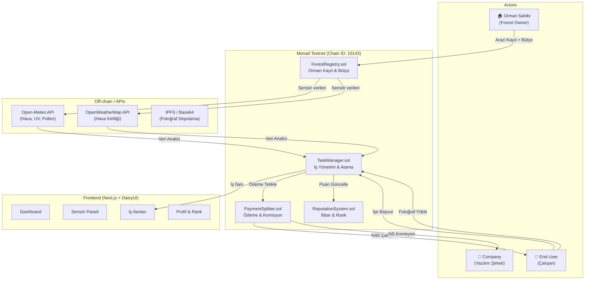

# ForestGuard DAO — Autonomous Forest/Agricultural Land Management Platform

Sensör verileri ile otonom olarak yönetilen, iş ilanı oluşturan, çalışanları crypto ile ödüllendiren ve itibar sistemi barındıran Web3 tabanlı bir orman/tarım arazisi yönetim platformu.

## Mimari Genel Bakış



## Kullanıcı İncelemesi Gerekli

> [!IMPORTANT]
> **Monad Testnet RPC**: `https://testnet-rpc.monad.xyz` (Chain ID: 10143, Currency: MON) kullanılacak. Testnet MON'lar için [faucet.monad.xyz](https://faucet.monad.xyz) kullanılmalıdır.

> [!IMPORTANT]
> **Monskills Entegrasyonu**: `npx skills add therealharpaljadeja/monskills` komutu ile monskills skill seti projeye eklenecektir. Bu, Monad'a özgü deployment, verification ve wallet yönetimi için gereklidir.

## Çözülen Kararlar

- ✅ **Komisyon Oranı**: %5 — Onaylandı
- ✅ **Fotoğraf Doğrulama**: İlk prototip için fotoğraf yüklendiğinde otomatik onay, fotoğraf kayıt edilmeyecek. Basit kabul sistemi.
- ✅ **Sensör Lokasyonu**: Public API üzerinden çekilecek veriler (koordinatlar frontend'de girilir, API'den veri çekilir)
- ✅ **Token**: Native MON kullanılacak
- ✅ **Fotoğraf Depolama**: Fotoğraf depolanmayacak — ilk prototipte yükleme otomatik onay tetikliyor
- ✅ **Çoklu Arazi**: Bir owner birden fazla arazi kaydedebilecek
- ✅ **Zaman Sınırı**: Şuanlık yok — deadline mekanizması olmayacak

---

## Önerilen Değişiklikler

### Faz 0 — Proje Altyapısı & Monad Konfigürasyonu

Projeyi Monad testnet için yapılandırma, monskills entegrasyonu ve OpenZeppelin kurulumu.

#### [MODIFY] [foundry.toml](file:///c:/Users/Hp/tryBlockCh/agublockchn/packages/foundry/foundry.toml)
- Monad testnet RPC endpoint eklenmesi: `monadTestnet = "https://testnet-rpc.monad.xyz"`
- Etherscan verification için Monad explorer eklenmesi

#### [MODIFY] [scaffold.config.ts](file:///c:/Users/Hp/tryBlockCh/agublockchn/packages/nextjs/scaffold.config.ts)
- Custom Monad Testnet chain definition eklenmesi (chainId: 10143, name: "Monad Testnet", rpcUrl, explorer)
- `targetNetworks` içine Monad Testnet eklenmesi
- `pollingInterval` 2000ms'ye düşürülmesi (L1 olsa da Monad'ın yüksek throughput'u nedeniyle)

#### Komutlar
```bash
# Monskills skill setinin eklenmesi
npx skills add therealharpaljadeja/monskills

# OpenZeppelin contracts kurulumu (Foundry)
cd packages/foundry && forge install OpenZeppelin/openzeppelin-contracts --no-commit
```

---

### Faz 1 — Akıllı Kontratlar (Smart Contracts)

4 adet akıllı kontrat geliştirilecek. Tümü `packages/foundry/contracts/` altına yazılacak.

#### [NEW] [ForestRegistry.sol](file:///c:/Users/Hp/tryBlockCh/agublockchn/packages/foundry/contracts/ForestRegistry.sol)

Orman/arazi kaydı ve bütçe yönetimi kontratı.

**Özellikler:**
- `registerForest(string name, int256 lat, int256 lon, uint256 area)` — Yeni orman/arazi kaydı
- `depositBudget(uint256 forestId)` — Ormana bütçe yatırma (payable)
- `withdrawBudget(uint256 forestId, uint256 amount)` — Owner tarafından bütçe çekme
- `getForestInfo(uint256 forestId)` — Orman bilgilerini sorgulama
- Her orman'ın bir wallet adresi (owner), bütçe bakiyesi, konum bilgisi ve aktiflik durumu olacak
- `Ownable` (OZ) ile owner yetkilendirmesi

**Veri Yapıları:**
```solidity
struct Forest {
    uint256 id;
    address owner;
    string name;
    int256 latitude;
    int256 longitude;
    uint256 areaSqMeters;
    uint256 budget;
    bool active;
    uint256 createdAt;
}
```

#### [NEW] [TaskManager.sol](file:///c:/Users/Hp/tryBlockCh/agublockchn/packages/foundry/contracts/TaskManager.sol)

İş ilanı oluşturma, atama ve tamamlama kontratı. **Sistemin kalbi.**

**Özellikler:**
- `createTask(uint256 forestId, string title, string description, uint256 reward, TaskCategory category, TaskPriority priority)` — İş ilanı oluşturma (sadece forest owner veya otomasyon)
- `applyForTask(uint256 taskId)` — İşe başvurma (ilk gelen alır — FCFS + rank bonus)
- `submitProof(uint256 taskId, string proofURI)` — İş tamamlama kanıtı (fotoğraf URI)
- `approveTask(uint256 taskId)` — Owner tarafından iş onayı → ödeme tetikleme
- `rejectTask(uint256 taskId)` — Owner tarafından iş reddi
- `cancelTask(uint256 taskId)` — İş iptal etme

**Veri Yapıları:**
```solidity
enum TaskStatus { Open, Assigned, ProofSubmitted, Completed, Rejected, Cancelled }
enum TaskCategory { TreePlanting, Irrigation, PestControl, FirePrevention, SoilMaintenance, WasteCleanup, Monitoring, Other }
enum TaskPriority { Low, Medium, High, Critical }

struct Task {
    uint256 id;
    uint256 forestId;
    address creator;
    address assignee;
    string title;
    string description;
    uint256 reward;
    TaskCategory category;
    TaskPriority priority;
    TaskStatus status;
    string proofURI;
    uint256 createdAt;
    uint256 completedAt;
    uint256 deadline;
}
```

**İş Atama Mantığı:**
- İlk başvuran atanır (FCFS)
- Rank sistemiyle yüksek ranklı kullanıcılar işleri daha erken görür (frontend seviyesinde — erken bildirim)
- Deadline aşılırsa iş tekrar açılır

#### [NEW] [ReputationSystem.sol](file:///c:/Users/Hp/tryBlockCh/agublockchn/packages/foundry/contracts/ReputationSystem.sol)

Çalışan itibar ve rank sistemi.

**Özellikler:**
- `addReputation(address worker, uint256 points)` — Puan ekleme (sadece TaskManager çağırabilir)
- `getReputation(address worker)` — Puanı sorgulama
- `getRank(address worker)` — Rank hesaplama (Bronze/Silver/Gold/Platinum/Diamond)
- `getWorkerStats(address worker)` — İstatistikler (tamamlanan iş, toplam kazanç vb.)

**Rank Sistemi:**
| Rank | Minimum Puan | Avantajlar |
|------|-------------|------------|
| 🥉 Bronze | 0 | Temel erişim |
| 🥈 Silver | 100 | İşleri 5 dk erken görme |
| 🥇 Gold | 500 | İşleri 15 dk erken görme |
| 💎 Platinum | 1500 | İşleri 30 dk erken görme + Yüksek öncelikli işlere erişim |
| 👑 Diamond | 5000 | İşleri 1 saat erken görme + Kritik işlere özel erişim |

**Puanlama:**
- İş tamamlama: +10 puan × priority multiplier (Low:1, Medium:2, High:3, Critical:5)
- Süre içinde tamamlama bonusu: +5 ekstra puan
- İş reddi: -5 puan

#### [NEW] [PaymentSplitter.sol](file:///c:/Users/Hp/tryBlockCh/agublockchn/packages/foundry/contracts/PaymentSplitter.sol)

Ödeme ve komisyon yönetimi.

**Özellikler:**
- `processPayment(address worker, uint256 forestId, uint256 amount)` — Ödemeyi bölüştürme
- Worker'a %95, Company wallet'a %5 komisyon
- `setCompanyWallet(address wallet)` — Şirket wallet adresi güncelleme
- `setCommissionRate(uint256 rate)` — Komisyon oranı güncelleme (sadece company admin)
- Ödeme geçmişi logları (event'ler ile)

**Event'ler:**
```solidity
event PaymentProcessed(uint256 indexed taskId, address indexed worker, uint256 workerAmount, uint256 companyFee);
event CommissionRateUpdated(uint256 oldRate, uint256 newRate);
```

#### [DELETE] [YourContract.sol](file:///c:/Users/Hp/tryBlockCh/agublockchn/packages/foundry/contracts/YourContract.sol)
- Scaffold-ETH 2 varsayılan kontratı silinecek

---

### Faz 2 — Deploy Scriptleri

#### [NEW] [DeployForestGuard.s.sol](file:///c:/Users/Hp/tryBlockCh/agublockchn/packages/foundry/script/DeployForestGuard.s.sol)

Tüm kontratları deploy eden script:
1. `ReputationSystem` deploy
2. `PaymentSplitter` deploy (company wallet parametresiyle)
3. `ForestRegistry` deploy
4. `TaskManager` deploy (ForestRegistry, ReputationSystem, PaymentSplitter adresleri ile)
5. Kontratlar arası yetkilendirme (TaskManager'a ReputationSystem ve PaymentSplitter'da işlem yapma yetkisi)

#### [MODIFY] [Deploy.s.sol](file:///c:/Users/Hp/tryBlockCh/agublockchn/packages/foundry/script/Deploy.s.sol)
- `DeployForestGuard` script'ini çağıracak şekilde güncelleme

#### [DELETE] [DeployYourContract.s.sol](file:///c:/Users/Hp/tryBlockCh/agublockchn/packages/foundry/script/DeployYourContract.s.sol)
- Varsayılan deploy script'i silinecek

---

### Faz 3 — Sensör Veri Entegrasyonu (API Routes)

Next.js API routes ile çevresel sensör verilerini toplama ve iş önerisi oluşturma.

#### [NEW] [app/api/sensors/route.ts](file:///c:/Users/Hp/tryBlockCh/agublockchn/packages/nextjs/app/api/sensors/route.ts)

Tüm sensör verilerini tek endpoint'ten toplayan API:

| Veri | API Kaynağı | Endpoint |
|------|------------|----------|
| Hava Durumu (sıcaklık, nem, basınç) | Open-Meteo | `api.open-meteo.com/v1/forecast` |
| UV Index | Open-Meteo | Aynı endpoint, `uv_index` parametresi |
| Hava Kirliliği (PM2.5, PM10, CO, NO2) | Open-Meteo Air Quality | `air-quality-api.open-meteo.com/v1/air-quality` |
| Pollen | Open-Meteo | `air-quality-api.open-meteo.com/v1/air-quality` (pollen parametreleri) |
| Rüzgar Hızı / Yönü | Open-Meteo | Forecast endpoint |

**Neden Open-Meteo?** API key gerektirmez, ücretsizdir, non-commercial kullanım için sınırsızdır.

**Response Formatı:**
```typescript
type SensorData = {
  temperature: number;       // °C
  humidity: number;          // %
  pressure: number;          // hPa
  windSpeed: number;         // km/h
  uvIndex: number;           // 0-11+
  airQualityIndex: number;   // AQI (0-500)
  pm25: number;              // µg/m³
  pm10: number;              // µg/m³
  pollenBirch: number;       // grains/m³
  pollenGrass: number;       // grains/m³
  precipitation: number;     // mm
  soilMoisture: number;      // m³/m³
  timestamp: string;
}
```

#### [NEW] [app/api/sensors/analyze/route.ts](file:///c:/Users/Hp/tryBlockCh/agublockchn/packages/nextjs/app/api/sensors/analyze/route.ts)

Sensör verilerini analiz ederek iş önerisi oluşturan akıllı analiz motoru:

| Koşul | Önerilen İş | Kategori | Öncelik |
|-------|------------|----------|---------|
| Nem < %30 | "Sulama gerekiyor" | Irrigation | High |
| UV Index > 8 | "Gölge yapı kontrolü" | Monitoring | Medium |
| PM2.5 > 50 | "Hava filtresi bakımı" | Monitoring | High |
| Rüzgar > 60 km/h | "Yangın risk değerlendirmesi" | FirePrevention | Critical |
| Sıcaklık < 0°C | "Don koruma önlemleri" | TreePlanting | High |
| Pollen > yüksek | "Alerjen kontrol" | PestControl | Medium |
| Yağış > 50mm | "Erozyon kontrolü" | SoilMaintenance | High |

---

### Faz 4 — Frontend Bileşenleri (Next.js + DaisyUI)

#### [NEW] [app/dashboard/page.tsx](file:///c:/Users/Hp/tryBlockCh/agublockchn/packages/nextjs/app/dashboard/page.tsx)
Ana dashboard sayfası — role-based görünüm:
- **Owner View**: Orman listesi, bütçe özeti, aktif işler, sensör durumu
- **Worker View**: Mevcut işler, başvurulan işler, kazanç özeti, rank durumu
- **Company View**: Toplam komisyon, platform istatistikleri

#### [NEW] [app/forests/page.tsx](file:///c:/Users/Hp/tryBlockCh/agublockchn/packages/nextjs/app/forests/page.tsx)
Orman kayıt ve yönetim sayfası:
- Yeni orman kaydı formu (isim, konum, alan)
- Bütçe yatırma/çekme
- Orman detay görünümü

#### [NEW] [app/tasks/page.tsx](file:///c:/Users/Hp/tryBlockCh/agublockchn/packages/nextjs/app/tasks/page.tsx)
İş ilanları sayfası:
- Açık işler listesi (filtreleme: kategori, öncelik, ödül)
- İşe başvurma butonu
- İş detay modali
- Fotoğraf yükleme (proof submission)

#### [NEW] [app/sensors/page.tsx](file:///c:/Users/Hp/tryBlockCh/agublockchn/packages/nextjs/app/sensors/page.tsx)
Sensör verileri dashboard'u:
- Gerçek zamanlı sensör kartları (sıcaklık, nem, UV, hava kalitesi vb.)
- Grafik görselleştirmeler
- Otomatik iş önerisi paneli
- "İş Oluştur" butonu (sensör verisinden otomatik doldurma)

#### [NEW] [app/profile/page.tsx](file:///c:/Users/Hp/tryBlockCh/agublockchn/packages/nextjs/app/profile/page.tsx)
Kullanıcı profil ve rank sayfası:
- İtibar puanı ve rank gösterimi
- Tamamlanan işler geçmişi
- Toplam kazanç
- Rank ilerleme çubuğu

#### [NEW] [components/forest-guard/](file:///c:/Users/Hp/tryBlockCh/agublockchn/packages/nextjs/components/forest-guard/)
Yeniden kullanılabilir bileşenler:

| Bileşen | Açıklama |
|---------|----------|
| `SensorCard.tsx` | Tek sensör verisi kartı (ikon, değer, durum rengi) |
| `TaskCard.tsx` | İş ilanı kartı (başlık, ödül, kategori, öncelik badge) |
| `RankBadge.tsx` | Kullanıcı rank badge'i (Bronze→Diamond) |
| `ForestCard.tsx` | Orman özet kartı (isim, bütçe, aktif iş sayısı) |
| `ProofUpload.tsx` | Fotoğraf yükleme bileşeni |
| `TaskStatusTimeline.tsx` | İş durumu timeline'ı |
| `BudgetChart.tsx` | Bütçe dağılımı chart |
| `SensorDashboard.tsx` | Tüm sensörlerin grid görünümü |

#### [MODIFY] [app/page.tsx](file:///c:/Users/Hp/tryBlockCh/agublockchn/packages/nextjs/app/page.tsx)
Landing page — ForestGuard tanıtım sayfası:
- Hero section ("Ormanları Koruyun, Crypto Kazanın")
- Platform özellikleri
- Nasıl çalışır (adım adım)
- İstatistikler

#### [MODIFY] [components/Header.tsx](file:///c:/Users/Hp/tryBlockCh/agublockchn/packages/nextjs/components/Header.tsx)
Navigasyon güncelleme — yeni sayfalar ekleme:
- Dashboard, Forests, Tasks, Sensors, Profile

---

### Faz 5 — Custom Hook'lar

#### [NEW] [hooks/forest-guard/](file:///c:/Users/Hp/tryBlockCh/agublockchn/packages/nextjs/hooks/forest-guard/)

| Hook | Açıklama |
|------|----------|
| `useSensorData.ts` | Sensör verilerini periyodik olarak çeken hook |
| `useTaskAnalysis.ts` | Sensör verilerinden iş önerisi oluşturan hook |
| `useForestBudget.ts` | Orman bütçe durumunu izleyen hook |
| `useWorkerRank.ts` | Çalışan rank ve itibar bilgisini çeken hook |

---

### Faz 6 — Monad Testnet Deploy & Verify

Monskills skill setini takip ederek deployment:

1. **Wallet Oluşturma**: `monskills/wallet` skill takibi
2. **Faucet**: Monad Testnet faucet'ten MON alma
3. **Deploy**: `yarn deploy --network monadTestnet`
4. **Verify**: Monskills verification API ile 3 explorer'da birden doğrulama

---

## Dosya Ağacı (Özet)

```
packages/
├── foundry/
│   ├── contracts/
│   │   ├── ForestRegistry.sol          [NEW]
│   │   ├── TaskManager.sol             [NEW]
│   │   ├── ReputationSystem.sol        [NEW]
│   │   └── PaymentSplitter.sol         [NEW]
│   ├── script/
│   │   ├── Deploy.s.sol                [MODIFY]
│   │   └── DeployForestGuard.s.sol     [NEW]
│   ├── test/
│   │   ├── ForestRegistry.t.sol        [NEW]
│   │   ├── TaskManager.t.sol           [NEW]
│   │   ├── ReputationSystem.t.sol      [NEW]
│   │   └── PaymentSplitter.t.sol       [NEW]
│   └── foundry.toml                    [MODIFY]
│
└── nextjs/
    ├── app/
    │   ├── page.tsx                    [MODIFY] — Landing page
    │   ├── dashboard/page.tsx          [NEW]
    │   ├── forests/page.tsx            [NEW]
    │   ├── tasks/page.tsx              [NEW]
    │   ├── sensors/page.tsx            [NEW]
    │   ├── profile/page.tsx            [NEW]
    │   └── api/
    │       └── sensors/
    │           ├── route.ts            [NEW]
    │           └── analyze/route.ts    [NEW]
    ├── components/
    │   ├── Header.tsx                  [MODIFY]
    │   └── forest-guard/
    │       ├── SensorCard.tsx          [NEW]
    │       ├── TaskCard.tsx            [NEW]
    │       ├── RankBadge.tsx           [NEW]
    │       ├── ForestCard.tsx          [NEW]
    │       ├── ProofUpload.tsx         [NEW]
    │       ├── TaskStatusTimeline.tsx  [NEW]
    │       ├── BudgetChart.tsx         [NEW]
    │       └── SensorDashboard.tsx     [NEW]
    ├── hooks/
    │   └── forest-guard/
    │       ├── useSensorData.ts        [NEW]
    │       ├── useTaskAnalysis.ts      [NEW]
    │       ├── useForestBudget.ts      [NEW]
    │       └── useWorkerRank.ts        [NEW]
    └── scaffold.config.ts              [MODIFY]
```

---

## Uygulama Sırası

| Sıra | Faz | Tahmini Süre | Bağımlılıklar |
|------|-----|-------------|---------------|
| 1 | Faz 0: Proje Altyapısı & Monad Config | ~30 dk | Yok |
| 2 | Faz 1: Akıllı Kontratlar | ~2 saat | Faz 0 |
| 3 | Faz 2: Deploy Scriptleri | ~30 dk | Faz 1 |
| 4 | Faz 3: Sensör API Routes | ~1 saat | Faz 0 |
| 5 | Faz 4: Frontend Bileşenleri | ~3 saat | Faz 2, Faz 3 |
| 6 | Faz 5: Custom Hook'lar | ~1 saat | Faz 4 |
| 7 | Faz 6: Monad Testnet Deploy | ~30 dk | Faz 1-5 |

**Toplam Tahmini Süre: ~8-9 saat**

---

## Doğrulama Planı

### Otomatik Testler
```bash
# Solidity unit testleri
cd packages/foundry && forge test -vvv

# Build kontrolü
yarn compile

# Frontend build kontrolü
yarn next:build
```

### Manuel Doğrulama
- [ ] Orman kaydı yapılabiliyor mu?
- [ ] Bütçe yatırma/çekme çalışıyor mu?
- [ ] Sensör verileri API'den doğru çekiliyor mu?
- [ ] Sensör verilerinden otomatik iş önerisi oluşuyor mu?
- [ ] İş ilanına başvuru ve atama çalışıyor mu?
- [ ] Fotoğraf yükleme ve iş onayı çalışıyor mu?
- [ ] Ödeme bölüştürme doğru mu (%95 worker, %5 company)?
- [ ] İtibar puanı doğru güncelleniyor mu?
- [ ] Rank sistemi doğru çalışıyor mu?
- [ ] Monad testnet'te kontratlar deploy ediliyor mu?

### Tarayıcı Testleri
- Dashboard'un tüm roller için doğru görünmesi
- Sensör kartlarının gerçek veri göstermesi
- İş akışının baştan sona çalışması (oluştur → başvur → kanıt → onayla → öde)
